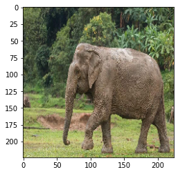
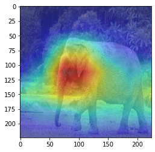

# Heat Map Using AI

This repository contains a project for generating heat maps using AI techniques. The project involves loading an image, processing it through a pre-trained ResNet50 model, and visualizing the heat map on the image.

## Table of Contents

- [Introduction](#introduction)
- [Methodology](#methodology)
- [Model](#model)
- [Results](#results)
- [Contributing](#contributing)

## Introduction

The goal of this project is to create a heat map overlay on an image using a pre-trained ResNet50 model. The heat map highlights the areas of the image that are most significant according to the model.

## Methodology

Took advantage of pretrained model Resnet50 Architecture that's trained on ImageNet dataset by using to classify the object first then take the last layer weights and multiply them with the predication of the last Convolution layer it have, so in a way to see where the model saw that object. 

## Model

The model used in this project is the ResNet50 neural network implemented using TensorFlow. The model is used to extract features from the image and generate a heat map based on the class activation map (CAM) technique.

### Model Architecture

- Pre-trained ResNet50 model
- Intermediate layers for feature extraction
- Final layer weights for generating the heat map

## Results

After processing the image through the ResNet50 model, a heat map is generated and overlaid on the original image. The results are visualized using Matplotlib.

> [!NOTE]
> the experiment was done on google colab and i forgot to make the requirements.txt file.

## Contributing

Contributions are welcome! If you have any suggestions or improvements, feel free to open an issue or submit a pull request.

